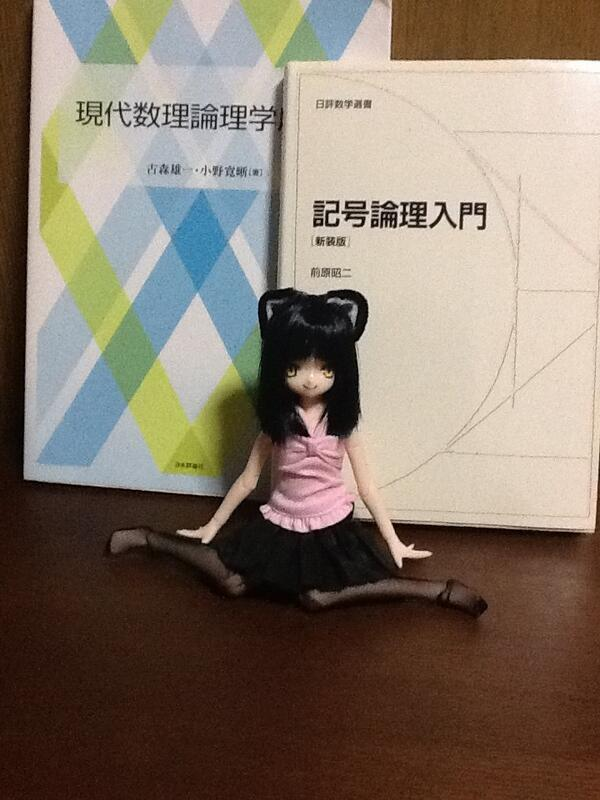

ドールをつくった
================================================================================

昨日， `@haru2036 <https://twitter.com/haru2036>`_ に，秋葉原でドールの作り方とか
必要な材料とかいろいろと教えてもらった．前々から興味はあったのだけど，なにを買えばいいか
わからないし，やり方もわからないので，手を出していなかったのだ．そこで彼に案内してもらい
この界隈に入門した．

必要な材料は，まず素体，各種衣装，それに，植毛ヘッド，絵の具， Liquitex という絵の具，
筆，アクリル溶剤，つや消し，それから，ネコミミを自作するために，
カチューシャと布，小さなハサミ，ピンセット，セメダイン．

アイペイントの HOWTO 本を買い，ドールの目やら眉やら口やらを描いた．
髪を切り，ネコミミをつくった．それから最後に服を着せてあげたら完成．

具体的な工程や詳細は記録していないので忘れた．ともかく完成品がこれだ．
背景の本は，それをおかないとうまく色が映らなかったのでおいてある．

ちなみに，キャラクターはフィーム・ユサクトンというオリジナルキャラクターだ．
当然みんなは知らないだろうが，ぼくの中ではイラストを描いたり小説を描いたりして
それなりに愛着のあるキャラクターだ．

次のイラストの左側のキャラクターのことだ．

