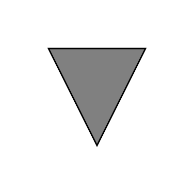

SVG Font をつくろう！
================================================================================

SVG でフォントがつくれる。
試しにつくってみよう。

SVG って？
--------------------------------------------------------------------------------

と、その前に、 SVG について確認しておこう。
SVG とはなんぞや？ SVG とは、ベクタ画像の形式の一種で、 XML で
記述される。いちばん簡単な SVG を書いてみよう。

.. literalinclude:: hello.svg
   :language: xml

表示はこのようになる。

ベクタ画像なので、ビットマップ画像よりもなめらかに表示されるはずだ。

SVG Font って？
--------------------------------------------------------------------------------

SVG フォントというのは、 SVG 内に埋め込める
フォントのことで、パスを使ってフォントを描画できる。
このフォントは SVG 内の text 命令で描画に使用できる
だけでなく、 CSS では @font-face で読み出すことができる [#a]_ 。

2014年3月現在、 Safari, Opera, Chrome では SVG フォントを
問題なく利用できるが、 IE, FireFox では動かないみたいだ [#b]_ 。
IE はまぁいいとして、ぼく自身が FireFox ユーザであるのもあり、
これはけっこう致命的な問題だ。

標準的な ttf みたいなフォーマットを使ったほうが
いい気もする。

どうやってつくる？
--------------------------------------------------------------------------------

SVG Font をつくるのには Inkscape などを使うと
いいが、 ttf とかと違い、バイナリ形式ではなく XML で記述されるので、
各種 XML テンプレートエンジンを使って人間が書くこともできる。
今回はとりあえず SVG Font を XML を書いてつくってみることにする。

SVG でフォントをつくるために、
読むべき資料は `SVG 1.1 (Second Edition) 20 Fonts <http://www.w3.org/TR/SVG/fonts.html>`_
と `SVG 1.1 (Second Edition) 8 Paths <http://www.w3.org/TR/SVG/paths.html>`_ だ。
これらを参考にすれば簡単なフォントをつくることができる。

では実際につくってみよう。
今回は a を三角として表示することにしてみる。

そのコードが次だ。

:download:`simple-font.svg` :

.. literalinclude:: simple-font.svg
   :language: xml

simple-font.svg を使うための HTML も書く。

:download:`simple-font-test.html` :

.. literalinclude:: simple-font-test.html
   :language: html

:download:`simple-font-test.html` に、 a ではなく
三角という形の文字が表示されれば成功だ。

コードをひとつひとつ軽く説明してみよう。
simple-font.svg の svg 要素は飛ばすとして、
defs 要素でフォントなどの宣言をおこなう。
その中に font 要素をいくつか並べる。 font 要素の
中の font-face 属性でファミリや units-per-em という単位を定義する。
units-per-em という単位が何を意味するものなのかややこしいのだ。
説明が面倒なので、詳しくはググってくれ。 glyph 要素は文字の形などの文字に関する
情報を定義する。 horiz-adv-x 属性は文字の幅であり、文字ごとに定義
できる。 unicode 属性は Unicode のどの文字をマッピングするか
を定義する。 a や b といった形式か、あるいは &#97; といった形式で
指定できる。 d 属性はパスデータで使われるものと
同じであり、たとえば L x y は、現在の点から x y に向かって直線を
ひくという意味になる。この属性の値が文字の形になる。
ちなみに M x y は現在の点を x y に変更するという意味で、主に初期値を
定めるのに使う。

さて、注意事項がひとつある。
ひとつの svg ファイルで、複数のフォント・ファミリを
定義している場合だ。今回はたまたまファミリがひとつだったから
問題なかったが、複数のフォント・ファミリが定義してある
場合、 CSS はそれらを区別できない (simple-font.svg の font-face で font-famiry を
定義しているのだから区別してくれてもいいような気もするのだけど、
どういうわけか区別できない)。だから、フォントを一意に探せる
ように id を振ってやる必要がある。

言葉でいうよりもコードでいうほうがはやい。

:download:`simple-font2.svg` :

.. literalinclude:: simple-font2.svg
   :language: xml

:download:`simple-font-test2.html` :

.. literalinclude:: simple-font-test2.html
   :language: html

svg の定義の中で font に ``id="simple-font"`` のように id を振って、さらに
CSS から参照するときは ``simple-font2.svg#simple-font``
のようにする。

フォント・ファミリが違うのだから id を指定する
必要はないのでは？　と思うが、それを期待して書いてもうまくいかない。
次のコードはうまくいかない例になっている。

:download:`simple-font-test3.html` :

.. literalinclude:: simple-font-test3.html
   :language: html

Inkscape でつくる
--------------------------------------------------------------------------------

さて、ここまで XML をごりごり書いてきたわけだが、
テキストを処理するなら CUI がいいのと同様に、
画像を処理するなら GUI がいいのだ。
`Inkscape <http://www.inkscape.org/>`_ が SVG Font を出力できる。
詳しい作り方は自分で調べてもらうことにして、
SVG Font をつくるなら Inkscape を使うとよいだろう。

あと、 SVG Editor として `svg-edit <http://code.google.com/p/svg-edit/>`_
や `Dia <https://wiki.gnome.org/Apps/Dia>`_ というものも
使ってみたのだけど、 結論は Inkscape は神だということになった。

あと、 Inkscape はひとつの SVG ファイルに複数の
フォント・ファミリを登録できるのだけど、
ひとつにしておいて、複数のフォント・ファミリをつくりたいなら
別のファイルにしたほうがいいだろう。前の項で
複数の ファミリを作るなら id を振らないといけないと
書いたけど、 SVG を出力する以上 Inkscape でも
同じ問題があるはずだ。そして、 Inkscape の場合
id を自動で振っているらしい。だから、 CSS から Inkscape で出力した
SVG Font を使いたいという場合、自動で振られた
id を調べて参照しないといけない。
これは面倒だし、トラブルになるかもしれない。
ファミリがひとつなら id を探さなくてもいい。
だから Inkscape で SVG Font をつくる場合、
ファミリごとにファイルを分けたほうがいいだろう。

参考文献
--------------------------------------------------------------------------------

.. [#a] `svg要素の基本的な使い方まとめ <http://www.h2.dion.ne.jp/~defghi/svgMemo/svgMemo_16.htm>`_
.. [#b] `WebフォントとSVGフォント <http://www.slideshare.net/fujisawa/web-27346698>`_